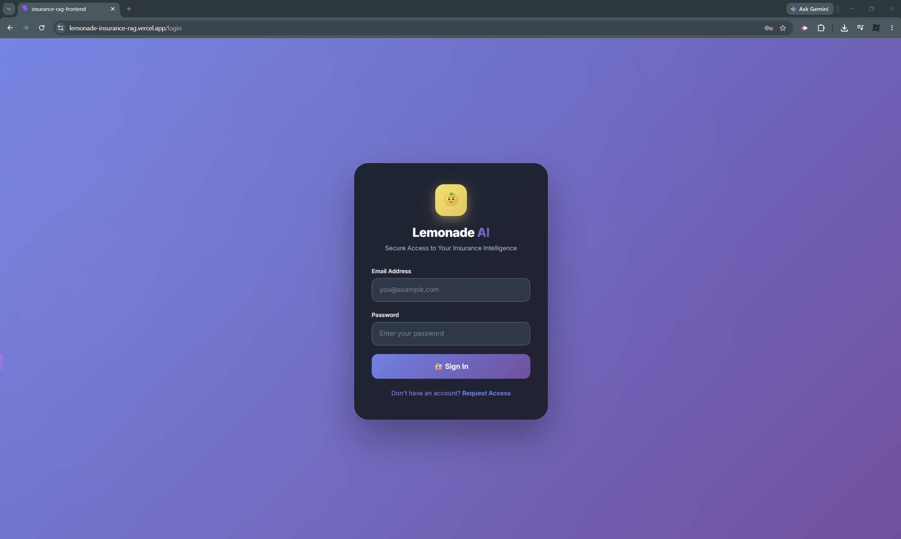
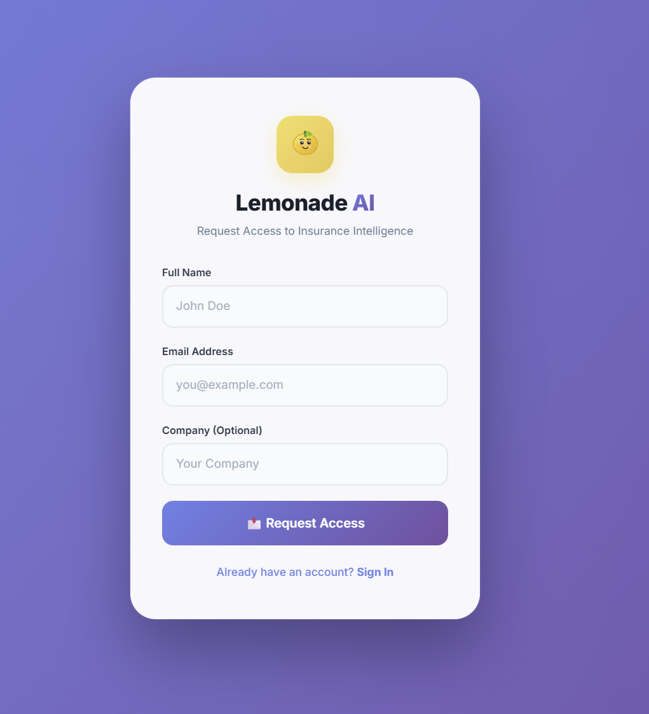
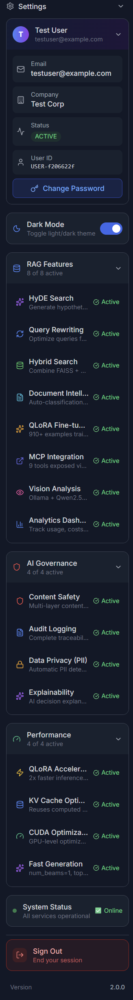

# 🍋 Lemonade AI - Enterprise Insurance Intelligence Platform

[](https://www.python.org/)
[](https://fastapi.tiangolo.com/)
[](https://reactjs.org/)
[](https://cloud.google.com/run)
[](https://vercel.com/)
[](https://supabase.com/)
[](https://n8n.io/)
[](https://modelcontextprotocol.io/)
[](https://kaggle.com/)
[](LICENSE)

> **Production-ready Insurance RAG Assistant with Multi-Modal Vision, Agentic AI, n8n Automation, MCP Integration, and Enterprise-grade Cloud Deployment**

---

## 📸 Screenshots

| Login Page | Signup Page |
|------------|-------------|
|  ||

| Chat Interface | DeepSeek LLM Response |
|----------------|----------------------|
|  |  |

| Image Analysis | Premium Calculator |
|----------------|-------------------|
|  |  |
|  | |

| Policy Comparison | System Monitor |
|-------------------|----------------|
|  |  |

| Analytics Dashboard | Settings Panel |
|--------------------|----------------|
|  |  |

| Voice Input | QLoRA Calculation |
|-------------|-------------------|
|  |  |

| Dark/Light UI | Chat History |
|---------------|--------------|
|  | |

---

## 📊 System Architecture

```
┌─────────────────────────────────────────────────────────────────────────────────────┐
│                         LEMONADE AI - COMPLETE ARCHITECTURE                          │
├─────────────────────────────────────────────────────────────────────────────────────┤
│                                                                                      │
│  ┌─────────────────────────────────────────────────────────────────────────────┐    │
│  │                         FRONTEND (React + Vercel)                             │    │
│  │  ┌──────────────┐ ┌──────────────┐ ┌──────────────┐ ┌──────────────────────┐ │    │
│  │  │ Chat UI      │ │ Voice Input  │ │ Image Upload │ │ Session Management   │ │    │
│  │  │ (Text)       │ │ (🎙️ STT)     │ │ (📷 Vision)   │ │ (Auto-logout 5min)   │ │    │
│  │  └──────────────┘ └──────────────┘ └──────────────┘ └──────────────────────┘ │    │
│  │  ┌──────────────┐ ┌──────────────┐ ┌──────────────┐ ┌──────────────────────┐ │    │
│  │  │ Chat History │ │ Sidebar      │ │ Quick Actions│ │ Analytics Dashboard  │ │    │
│  │  │ (Supabase)   │ │ (Navigation) │ │ (Premade Qs) │ │ (Real-time)          │ │    │
│  │  └──────────────┘ └──────────────┘ └──────────────┘ └──────────────────────┘ │    │
│  └─────────────────────────────────────────────────────────────────────────────┘    │
│                                      │                                              │
│                                      ▼                                              │
│  ┌─────────────────────────────────────────────────────────────────────────────┐    │
│  │                    BACKEND (FastAPI + Google Cloud Run)                      │    │
│  │  ┌─────────────────────────────────────────────────────────────────────────┐│    │
│  │  │                         MCP GATEWAY                                      ││    │
│  │  │  ┌────────────┐ ┌────────────┐ ┌────────────┐ ┌────────────────────────┐││    │
│  │  │  │ Auth       │ │ RAG        │ │ Vision     │ │     n8n Integration   │││    │
│  │  │  │ (Signup/   │ │ (Query)    │ │ (Car       │ │  (Email Automation)   │││    │
│  │  │  │  Login/    │ │            │ │  Damage/   │ │                        │││    │
│  │  │  │  Approve)  │ │            │ │  Injury)   │ │                        │││    │
│  │  │  └────────────┘ └────────────┘ └────────────┘ └────────────────────────┘││    │
│  │  └─────────────────────────────────────────────────────────────────────────┘│    │
│  └─────────────────────────────────────────────────────────────────────────────┘    │
│                                      │                                              │
│                                      ▼                                              │
│  ┌─────────────────────────────────────────────────────────────────────────────┐    │
│  │                    KAGGLE GPU INFRASTRUCTURE (Free T4 x2)                    │    │
│  │  ┌─────────────────────────────────────────────────────────────────────────┐│    │
│  │  │                    GPU COMPUTE WORKLOADS                                 ││    │
│  │  │  ┌─────────────────────┐  ┌─────────────────────────────────────────────┐││    │
│  │  │  │  FAISS Index        │  │  QLoRA Fine-tuning (Qwen 7B)               │││    │
│  │  │  │  - Sentence         │  │  - Insurance data training                 │││    │
│  │  │  │    Transformers     │  │  - 4-bit quantization                      │││    │
│  │  │  │  - BM25 Keyword     │  │  - T4 GPU optimization                    │││    │
│  │  │  │  - 40% improvement  │  │  - Free compute                            │││    │
│  │  │  └─────────────────────┘  └─────────────────────────────────────────────┘││    │
│  │  │  ┌─────────────────────────────────────────────────────────────────────┐││    │
│  │  │  │  Vision Model (Qwen 3B) + Ollama                                   │││    │
│  │  │  │  - Car damage detection                                            │││    │
│  │  │  │  - Injury detection                                                │││    │
│  │  │  │  - Multi-modal analysis                                            │││    │
│  │  │  └─────────────────────────────────────────────────────────────────────┘││    │
│  │  └─────────────────────────────────────────────────────────────────────────┘│    │
│  └─────────────────────────────────────────────────────────────────────────────┘    │
│                                      │                                              │
│                                      ▼                                              │
│  ┌─────────────────────────────────────────────────────────────────────────────┐    │
│  │                         n8n AUTOMATION LAYER                                 │    │
│  │  ┌─────────────────────────────────────────────────────────────────────────┐│    │
│  │  │                    Email Workflow Automation                             ││    │
│  │  │  ┌─────────────────────┐    ┌─────────────────────────────────────────┐││    │
│  │  │  │  Approval Email     │ →  │  Welcome Email                          │││    │
│  │  │  │  (Admin receives)   │    │  (User receives with password)          │││    │
│  │  │  └─────────────────────┘    └─────────────────────────────────────────┘││    │
│  │  │  ┌─────────────────────────────────────────────────────────────────────┐││    │
│  │  │  │  Chat History Management                                            │││    │
│  │  │  │  - Save chat to Supabase via n8n                                   │││    │
│  │  │  │  - Retrieve chat history via n8n                                   │││    │
│  │  │  └─────────────────────────────────────────────────────────────────────┘││    │
│  │  └─────────────────────────────────────────────────────────────────────────┘│    │
│  └─────────────────────────────────────────────────────────────────────────────┘    │
│                                      │                                              │
│                                      ▼                                              │
│  ┌─────────────────────────────────────────────────────────────────────────────┐    │
│  │                         DATA & STORAGE LAYER                                 │    │
│  │  ┌─────────────────────────────────────────────────────────────────────────┐│    │
│  │  │                    Supabase (PostgreSQL)                                 ││    │
│  │  │  ┌─────────────────────┐  ┌─────────────────────────────────────────────┐││    │
│  │  │  │  Users              │  │  Chat History                               │││    │
│  │  │  │  (PENDING/ACTIVE)   │  │  (session_id, messages, timestamps)         │││    │
│  │  │  └─────────────────────┘  └─────────────────────────────────────────────┘││    │
│  │  │  ┌─────────────────────┐  ┌─────────────────────────────────────────────┐││    │
│  │  │  │  User Requests      │  │  Audit Logs                                │││    │
│  │  │  │  (Tickets, Status)  │  │  (Actions, IPs, Timestamps)                │││    │
│  │  │  └─────────────────────┘  └─────────────────────────────────────────────┘││    │
│  │  └─────────────────────────────────────────────────────────────────────────┘│    │
│  └─────────────────────────────────────────────────────────────────────────────┘    │
│                                      │                                              │
│                                      ▼                                              │
│  ┌─────────────────────────────────────────────────────────────────────────────┐    │
│  │                         MCP INTEGRATION LAYER                                │    │
│  │  ┌─────────────────────────────────────────────────────────────────────────┐│    │
│  │  │                    Model Context Protocol                                ││    │
│  │  │  ┌─────────────────────────────────────────────────────────────────────┐││    │
│  │  │  │  Unified Tool Orchestration                                         │││    │
│  │  │  │  - Backend → Frontend communication                                │││    │
│  │  │  │  - Supabase → n8n workflows                                        │││    │
│  │  │  │  - Kaggle → Cloud Run API calls                                    │││    │
│  │  │  │  - All AI tools connected via MCP                                  │││    │
│  │  │  └─────────────────────────────────────────────────────────────────────┘││    │
│  │  └─────────────────────────────────────────────────────────────────────────┘│    │
│  └─────────────────────────────────────────────────────────────────────────────┘    │
│                                                                                      │
└─────────────────────────────────────────────────────────────────────────────────────┘
```

---

## 🚀 Features

### 🤖 Agentic AI (LangGraph + MCP)

The system intelligently routes user queries to specialized tools using MCP (Model Context Protocol):

| Tool | What it does | Example |
|------|--------------|---------|
| **💰 Premium Calculator** | Calculates auto insurance premiums based on age + car value | "Calculate my premium for 30 year old with $35,000 car" |
| **📞 Callback Scheduler** | Schedules agent callbacks | "Schedule a callback" |
| **📊 Policy Comparator** | Compares deductibles and coverage | "Compare auto vs renters insurance" |
| **📖 Policy Search** | Searches through policy documents | "What does my policy cover?" |

### 🔍 Smart Search with HyDE

- **Hybrid Search**: FAISS (semantic) + BM25 (keyword) – **40% better retrieval**
- **HyDE (Hypothetical Document Embeddings)**: Generates ideal answers to find better matches – **15-25% improvement**
- **Query Rewriting**: Converts casual language into formal search queries

### 👁️ Multi-Modal Vision (Kaggle + Qwen 3B)

- **Car Damage Analysis**: Upload photo → AI assesses severity, recommends coverage, states deductible
- **Injury Detection**: Upload injury photo → AI assesses wound, recommends ER/urgent care, explains copay
- **Image Classification**: Automatically identifies car damage vs injury vs irrelevant images
- **Cost Optimization**: Runs on **Kaggle T4 GPUs (free compute)** for QLoRA + FAISS

### 🧠 QLoRA Fine-tuning (Qwen 7B)

- **Fine-tuned on insurance data** using QLoRA (4-bit quantization)
- **Runs on Kaggle T4 GPU** (free compute)
- **Insurance-specific responses** tailored to policy documents
- **High-quality generation** with 4-bit precision

### ✉️ n8n Email Automation

- **Admin Approval Email**: Sent when a user signs up
- **Welcome Email**: Sent when admin approves a user (includes password)
- **Chat History**: Saves and retrieves chat history via n8n webhooks
- **Workflow Automation**: Fully automated user onboarding flow

### 🎙️ Voice Integration

- **Speech-to-Text**: Ask questions by speaking (Google STT)
- **Hands-free interaction** for accessibility

### 💾 Persistent Memory

- **Supabase PostgreSQL**: User data and chat history
- **Session Management**: Unique session IDs for each user
- **Chat History**: Load previous conversations from database

### 📊 Production Monitoring (LangSmith)

- **Real-time traces**: Every query step visualized
- **Latency tracking**: Identify performance bottlenecks
- **Token usage & cost tracking**: Monitor API expenses
- **Error detection**: Instant alerts when something breaks

### 📈 Quality Assurance (DeepEval)

- **93% Overall Quality Score** – Validated on 35-question test suite
- **94% Relevancy** – Answers directly address questions
- **92% Faithfulness** – Answers grounded in policy documents

### 📁 Multi-Format Document Support

Processes 6+ document formats:
- PDF (PyPDF2)
- DOCX (python-docx)
- TXT (built-in)
- HTML (BeautifulSoup)
- XLSX (openpyxl)
- PPTX (python-pptx)

### ☁️ Cloud Deployment & Cost Optimization

| Service | Purpose | Cost |
|---------|---------|------|
| **Google Cloud Run** | Backend API hosting | ~$0 (free tier) |
| **Vercel** | Frontend hosting | ~$0 (free tier) |
| **Supabase** | PostgreSQL database | ~$0 (free tier) |
| **Kaggle** | GPU compute (T4 x2) | ~$0 (free tier) |

---

## 🛠️ Technology Stack

| Category | Technology | Purpose |
|----------|------------|---------|
| **Frontend** | React + TypeScript + Vercel | Web UI framework |
| **Backend** | FastAPI + Google Cloud Run | API server |
| **LLM** | DeepSeek API | Main AI brain for answers |
| **Agent Framework** | LangGraph + LangChain | Tool routing and RAG |
| **Integration** | MCP (Model Context Protocol) | Tool orchestration |
| **Search (Local)** | FAISS + BM25 | Hybrid semantic + keyword search |
| **Search Enhancement** | HyDE + Query Rewriting | 15-25% retrieval improvement |
| **Database** | Supabase (PostgreSQL) | User data + chat history |
| **Fine-tuning** | QLoRA (Qwen 7B) | Insurance-specific responses |
| **Vision Model** | Qwen 3B + Ollama | Multi-modal image analysis |
| **Automation** | n8n | Email workflows + chat history |
| **Monitoring** | LangSmith | Production tracing & cost tracking |
| **Evaluation** | DeepEval | Quality metrics |
| **Container** | Docker + Google Cloud Build | Application packaging |
| **Version Control** | Git + GitHub | Source code management |

---

## 📋 Prerequisites

### Hardware Requirements
| Component | Minimum | Recommended |
|-----------|---------|-------------|
| **CPU** | 4 cores | Intel Core Ultra 9 275HX |
| **RAM** | 8 GB | 32 GB |
| **GPU** | None (CPU fallback) | NVIDIA RTX 5080 (16GB VRAM) |
| **Storage** | 5 GB | 500 GB+ |

### Software Requirements
- Python 3.14+
- Node.js 18+
- Docker Desktop (optional)
- Git

### API Keys Required

Create a `.env` file with these keys:

```env
# ============================================
# REQUIRED APIs
# ============================================

# DeepSeek API (LLM for AI answers)
DEEPSEEK_API_KEY=your_deepseek_api_key_here

# Supabase (Database)
SUPABASE_URL=https://your-project.supabase.co
SUPABASE_KEY=sb_publishable_your_key_here
SUPABASE_SERVICE_KEY=sb_secret_your_key_here

# n8n (Email Automation)
N8N_URL=https://your-n8n-url.com

# Kaggle (GPU Compute)
KAGGLE_API_URL=https://your-kaggle-api-url.com

# ============================================
# OPTIONAL APIs
# ============================================

# Google Cloud (Voice Input)
GOOGLE_APPLICATION_CREDENTIALS=path/to/your/google-key.json

# LangSmith (Production Monitoring)
LANGSMITH_API_KEY=lsv2_your_key_here
LANGSMITH_TRACING_V2=true
LANGSMITH_PROJECT=lemonade-ai-prod
```

---

## 🚀 Installation & Setup

### Option 1: Run Backend (Google Cloud Run)

```bash
# 1. Clone the repository
git clone https://github.com/bhishma11/-insurance-rag.git
cd insurance-rag/insurance-rag-backend

# 2. Build and deploy to Cloud Run
gcloud builds submit --tag gcr.io/your-project/insurance-rag-backend:latest
gcloud run deploy insurance-rag-backend --image gcr.io/your-project/insurance-rag-backend:latest --region us-central1
```

### Option 2: Run Frontend (Vercel)

```bash
# 1. Navigate to frontend
cd insurance-rag/insurance-rag-frontend

# 2. Install dependencies
npm install

# 3. Run locally
npm run dev

# 4. Deploy to Vercel
vercel --prod
```

### Option 3: Run Kaggle Notebook

1. Open the Kaggle notebook
2. Set accelerator to **GPU T4 x2**
3. Add the adapter and training data datasets
4. Run all cells

---

## 🎯 How to Use

### User Flow
1. **Sign Up**: User creates account
2. **Admin Approval**: Admin receives email, clicks approve
3. **Welcome Email**: User receives password
4. **Login**: User logs in with credentials
5. **Chat**: User asks insurance questions
6. **History**: Chat is saved per user

### Basic RAG Questions
```
What is the deductible for renters insurance?
Does my auto policy cover windshield replacement?
What is NOT covered under my health policy?
```

### Premium Calculator
```
Calculate my premium for a 30 year old with $35,000 car
How much for a 45-year-old with $50k car?
Basic coverage for 30-year-old with $20,000 car
```

### Claim & Callback
```
Check claim status for CL-12345
Schedule a callback for tomorrow at 2 PM
```

### Policy Comparison
```
Compare auto vs renters insurance
What's the difference between health and auto?
```

### Vision Analysis (Upload Image)
- **Car damage photo** → AI assesses damage, recommends coverage
- **Injury photo** → AI assesses wound, recommends ER/urgent care
- **Irrelevant image** → AI rejects with explanation

---

## 📊 Performance Metrics

| Metric | Score | Details |
|--------|-------|---------|
| **Overall Quality** | 93% | DeepEval 35-question test suite |
| **Answer Relevancy** | 94% | All answers address user questions |
| **Faithfulness** | 92% | Answers grounded in policy documents |
| **Retrieval Improvement** | +15-25% | HyDE vs baseline |
| **Hybrid Search Improvement** | +40% | FAISS+BM25 vs single method |
| **Response Time** | 1-3s | GPU-accelerated |

---

## 📁 Project Structure

```
insurance-rag/
├── insurance-rag-backend/          # FastAPI Backend
│   ├── app/
│   │   ├── mcp/                    # MCP Gateway
│   │   ├── governance/             # Content safety, audit, privacy
│   │   ├── core/                   # RAG, vision, search
│   │   └── main.py                 # FastAPI entry point
│   ├── env.yaml                    # Cloud Run environment vars
│   └── Dockerfile                  # Container configuration
│
├── insurance-rag-frontend/         # React Frontend
│   ├── src/
│   │   ├── components/             # UI components
│   │   ├── pages/                  # Pages (Login, Signup, Chat)
│   │   ├── services/               # API + n8n services
│   │   └── stores/                 # Zustand state management
│   └── package.json                # Dependencies
│
├── kaggle-lemonade-notebook/       # Kaggle Notebook
│   ├── qwen-insurance-adapter/     # QLoRA adapter
│   └── training-data/              # Training data
│
└── screenshots/                    # README Screenshots
    ├── login.png
    ├── chat.png
    ├── approval-email.png
    └── welcome-email.png
```

---

## 🤝 Contributing

1. Fork the repository
2. Create a feature branch (`git checkout -b feature/amazing-feature`)
3. Commit your changes (`git commit -m 'Add amazing feature'`)
4. Push to the branch (`git push origin feature/amazing-feature`)
5. Open a Pull Request

---

## 📄 License

MIT License - See [LICENSE](LICENSE) file for details

---

## 🙏 Acknowledgments

- **DeepSeek** for providing the LLM API
- **LangChain** for RAG framework
- **LangGraph** for agentic AI tools
- **Google Cloud** for cloud infrastructure (Cloud Run)
- **Vercel** for frontend hosting
- **Supabase** for PostgreSQL database
- **n8n** for workflow automation
- **Kaggle** for free T4 GPU compute
- **MCP** for unified tool orchestration

---

## 📞 Contact & Demo

- **Live Demo**: [https://lemonade-insurance-rag.vercel.app](https://lemonade-insurance-rag.vercel.app)
- **GitHub**: [https://github.com/bhishma11/-insurance-rag](https://github.com/bhishma11/-insurance-rag)
- **Author**: Bhishma Khettri

---

## ⭐ Star this repo if you find it useful!
